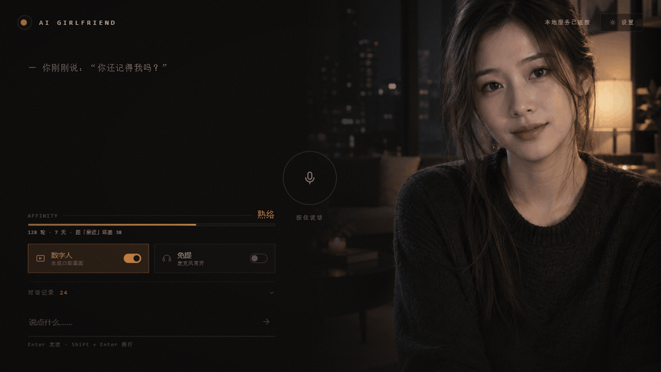
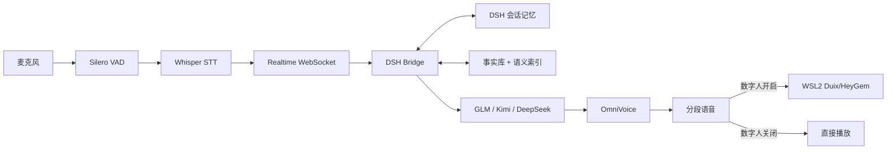
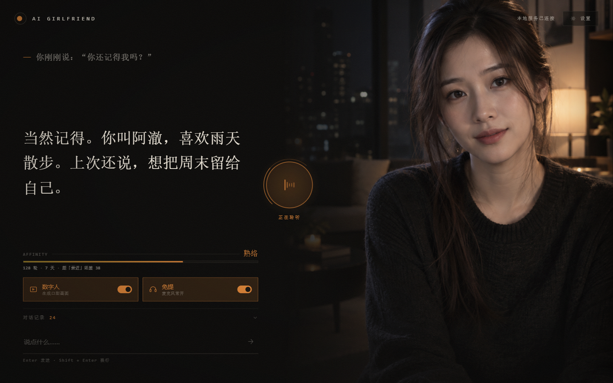
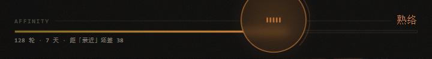

<div align="center">

# AI Girlfriend V2

> 一个面向 Windows 的本地语音陪伴系统：DSH 长期记忆、本地声音克隆、语义历史检索，以及可选的 WSL2 数字人口型。




</div>

普通语音助手经常只记得当前窗口，重启以后就像第一次见面。这个项目把语音识别、LLM、声音克隆、长期记忆和数字人口型串成一套 Windows 桌面体验，并把“她记得什么”开放给用户查看、修改和移出。

## 它能做什么

- **跨重启长期记忆**：DSH 会话检查点和 SQLite 长期事实库共同保存上下文。
- **大量历史语义检索**：不要求关键词完全相同，可以用改写后的问题找回旧对话。
- **可管理的事实记忆**：在设置中查看来源、人工更正或移出长期记忆。
- **本地语音链路**：Silero VAD → Whisper STT → OpenAI-compatible LLM → OmniVoice TTS。
- **两种输出模式**：数字人模式控制在 96 字内；纯语音模式允许更完整的回答，并按约 90 字、就近标点分段播放。
- **可选数字人**：Duix/HeyGem 在 WSL2 中运行；不开数字人时可以直接使用纯语音。
- **关系进度**：按有效对话轮次和真实来访日期累积，单日设上限，避免一次刷满。

## 工作方式



所有本机服务只监听 `127.0.0.1`。语言模型使用你自己配置的外部 API；语音识别、声音克隆、记忆索引和数字人口型在本机运行。

## 最快开始

> GitHub 仓库只保存源码、脚本和文档。约 15.6 GB 的 Python runtime、模型与 WSL rootfs 不进入 Git 历史；使用 Windows 整合包时，请确认这些目录已经随包提供。

### 先体验纯语音

1. 将整合包完整解压到纯英文、无空格路径，例如 `D:\AI-Girlfriend`。
2. 双击 `一键启动.cmd`。即使没有 WSL，也会自动进入纯语音模式。
3. 浏览器打开后，在“设置 → 语言模型”填写一个 API Key。
4. 包内默认声音可以直接使用；角色视频与自定义声音可以稍后再上传。

### 开启数字人

1. 双击 `首次安装.cmd`。
2. 如果 WSL2 已可用，安装器会直接导入数字人引擎。
3. 如果 WSL2 尚未启用，安装器会弹出 Windows 管理员授权并启用组件。
4. Windows 提示重启时，重启电脑，再次双击 `首次安装.cmd`。
5. 看到“数字人引擎就位”后，双击 `一键启动.cmd`。

完整的分支流程、硬件要求和故障处理见 [Windows 安装指南](docs/INSTALL.md)。

## 展示案例

| 场景 | 首次说法 | 之后的问题 | 预期行为 |
|---|---|---|---|
| 跨重启记住名字 | “我叫阿澈。” | 重启后问“你还记得我叫什么吗？” | 从长期事实库恢复“阿澈” |
| 语义找回历史 | “下雨时我喜欢出去走走。” | “我以前说过怎么度过雨天？” | 用语义相似度找回旧对话 |
| 人工纠错 | 自动记成旧昵称 | 在记忆面板改成新昵称 | 人工确认内容优先于后台抽取 |
| 输出模式 | 同一个问题 | 切换数字人开关 | 数字人 ≤96 字；纯语音分段继续说 |
| 中断恢复 | 回答生成中强制结束 | 重启后继续聊天 | 未完成轮次不推进检查点，不污染记忆 |

这些是可重复测试的合成案例，不包含真实用户聊天。详细结果与边界见 [案例说明](docs/CASES.md)。

<table>
  <tr>
    <td width="64%"></td>
    <td width="36%"></td>
  </tr>
</table>

## 关系进度

关系进度按“聊过多少轮”和“有对话的日期”累计。当前规则是每轮 1 分、每天首次对话 15 分、每天聊天分最多 40 分。界面显示的是当前阶段到下一阶段的真实百分比。



## 目录

```text
AI-Girlfriend-V2/
├── install.ps1 / 首次安装.cmd      # WSL2 与数字人首次安装
├── launch.ps1 / 一键启动.cmd       # 日常启动与纯语音降级
├── app/
│   ├── ui/                          # FastAPI UI 与浏览器前端
│   ├── dsh-bridge/                  # DSH、检查点、事实库、语义检索
│   ├── omnivoice/                   # OmniVoice 本地服务
│   ├── speech-to-speech/            # Realtime 语音管线
│   └── config/                      # 角色与管线配置
└── docs/                            # 安装、案例与公开演示素材
```

整合包中还会有以下未跟踪目录：`runtime/`、`AI-Girlfriend-Models/`、`engine/`、`app/.venv/`。它们体积大且各自有独立许可证，不能直接提交到 Git。

## 验证

```powershell
$env:PYTHONPATH = "app/.venv/Lib/site-packages;app/speech-to-speech/src"
runtime/python311/python.exe -m unittest discover `
  -s app/dsh-bridge/tests -p "test_*.py" -v
```

当前共 18 项单元测试，覆盖检查点原子写入与回退规则、首轮输入对齐、长期事实增改删查、检索抑制和两种输出模式。`app/dsh-bridge/tests/verify_*.py` 是需要本地模型、DSH 运行时和外部 API 的可选集成验证，不包含在上面的命令中。

## 隐私与发布边界

- API Key 保存在本机 `app/heygem-data/llm-provider.json`，不会进入 Git。
- 原始会话、事实库、声音、角色视频、日志和生成结果全部被 `.gitignore` 排除。
- “移出记忆”会从长期事实库和检索结果中抑制内容，但不会删除原始 DSH 会话档案。
- 发布整合包前必须单独核对每个模型、数字人引擎和默认媒体素材的再分发许可。

详见 [安全说明](SECURITY.md) 和 [第三方组件说明](THIRD_PARTY_NOTICES.md)。

## License

本仓库包含多个来源与不同许可边界，目前不对整个仓库声明单一许可证。Hugging Face `speech-to-speech` 保留其 Apache-2.0 许可证；其他第三方组件见 [THIRD_PARTY_NOTICES.md](THIRD_PARTY_NOTICES.md)。在确认 UI 源码来源、Duix/HeyGem、OmniVoice 模型和默认媒体素材的授权前，请勿公开源码或把二进制整合包作为可自由再分发内容发布。
