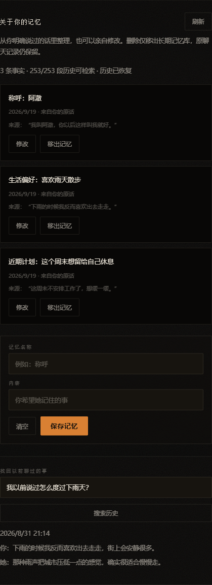

# 演示案例与验证边界

下面全部使用虚构信息，展示系统设计和自动测试覆盖范围，不包含真实用户聊天。

## 实际数字人输出

https://github.com/user-attachments/assets/734d01f7-ef1d-4a2d-b947-1e54ba1db3e9

▶ [播放器无法显示时，打开仓库内 MP4（8.32 秒，1280×720，含声音）](assets/digital-human-demo.mp4)

视频由整合包中的 OmniVoice 声音克隆与 Duix/HeyGem 口型管线实际生成。演示角色“苏晚”和台词均为虚构公开素材。台词为：“B站的朋友们好啊，我是苏晚，25岁，在北京写网剧。今天被她拉来当嘉宾，我不太会营业，将就着看。”

## 案例一：重启以后仍记得名字

```text
第 1 天
你：我叫阿澈，以后这样叫我就好。
她：好，阿澈。我记住了。

关闭程序并重新启动

你：你还记得我叫什么吗？
她：记得，你叫阿澈。
```

成功回答依赖两层信息：DSH 恢复已提交的会话检查点，长期事实库保存“称呼：阿澈”。只有完整成功的轮次才推进检查点，中断的半轮不会被当成可靠历史。

## 案例二：不用原关键词也能找回历史

```text
旧对话：下雨的时候我反而喜欢出去走走，街上会安静很多。
新问题：我以前说过怎么度过雨天？
```

语义索引使用本地 multilingual-e5-small，将改写后的问题与历史片段做相似度检索，因此不要求“下雨”“散步”等字面完全一致。



## 案例三：人工纠错不会被后台覆盖

1. 后台从原话抽取“昵称：小澈”。
2. 用户在记忆面板中人工改为“昵称：阿澈”。
3. 后台再次遇到旧来源时，人工确认值继续优先。

删除或更正后，对应来源会被长期检索抑制。原始 DSH 会话仍然保留，所以界面称为“移出记忆”，不承诺物理删除所有历史档案。

## 案例四：数字人与纯语音输出不同

| 模式 | 回复策略 | 播放方式 |
|---|---|---|
| 数字人开启 | 最多 96 字，通常两三句 | 一次提交短口型任务 |
| 数字人关闭 | 通常 120–480 字，最多 600 字保险限制 | 在约 90 字附近寻找标点，逐段合成播放 |

纯语音分段不是“一句一段”，相邻短句会合并，避免声音过碎。当前实现等待 LLM 完整生成后再按段发送，不是 token 级边生成边开口。

## 案例五：中断不能污染长期记忆

测试会在一次回答生成中强制结束 DSH 运行时，然后重启 bridge：

- 检查点仍停留在上一轮完整成功的位置。
- 恢复后看不到未提交的半轮修改。
- 当前检查点损坏时会按历史检查点逆序恢复。
- 全部历史不可读时阻止对话，不静默创建空记忆。

## 单元测试覆盖

默认命令运行的 18 项单元测试覆盖：

- 好感度单日上限和本档进度。
- 首轮、第二轮真实用户消息对齐。
- 检查点原子写入、坏索引处理、回退规则和显式重置。
- 长期事实的增加、人工更正、移出和检索抑制。
- 数字人 96 字硬限制。
- 纯语音按约 90 字及标点合并分段。

`verify_memory.py`、`verify_long_term.py` 和 `verify_output_modes.py` 是可选的真实集成验证，需要整合包中的 DSH、嵌入模型和已配置的外部 API。它们验证跨进程中断恢复、真实语义相似度和实际模型输出，不属于 18 项默认单元测试。

这些验证不能证明无限上下文，也不能保证任何模型在所有表达下都能正确抽取事实。语义检索质量仍受嵌入模型、历史表述和相似度阈值影响。
