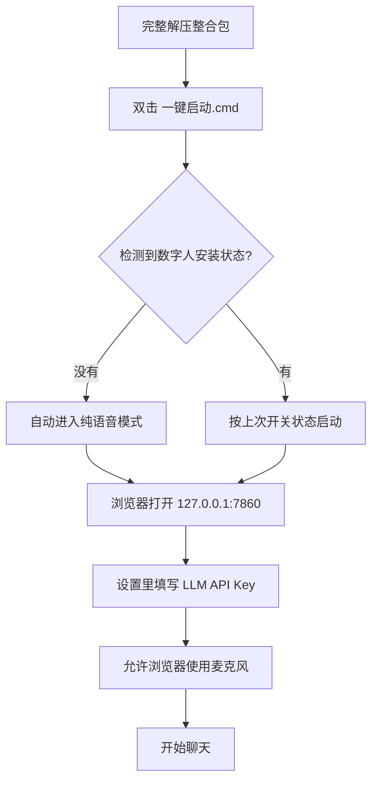
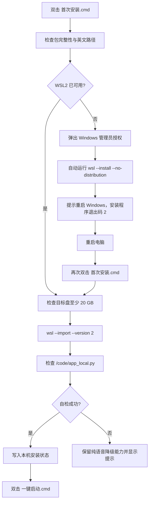

# Windows 完整安装流程

这份流程面向第一次接触 WSL 的用户。纯语音和数字人是两条独立路径：纯语音不需要 WSL；数字人口型需要 WSL2，并可能要求 Windows 重启一次。

## 1. 准备条件

| 项目 | 纯语音 | 数字人 |
|---|---:|---:|
| Windows 10/11 64 位 | 必须 | 必须 |
| NVIDIA 显卡 | 建议 8 GB+ | 建议 12 GB，8 GB 可尝试 |
| CPU 虚拟化 | 不需要 | 必须开启 |
| 剩余空间 | 约 20 GB | 建议 35 GB+ |
| WSL2 | 不需要 | 必须 |
| 外部 LLM API Key | 必须 | 必须 |

任务管理器 → 性能 → CPU 可以查看“虚拟化”是否已启用。未启用时需要进入 BIOS 打开 Intel VT-x 或 AMD SVM。

GitHub 源码不带大模型和数字人镜像，也不带固定 Python、FFmpeg、依赖层和 DSH 运行组件，不能仅靠下载四套模型直接启动。源码与整合包的区别、模型地址和固定版本见 [模型与数字人资源下载](MODELS.md)。本页后续的一键流程面向文件齐全、已经验证过的 Windows 整合包。

整合包必须完整解压到纯英文、无空格路径：

```text
正确：D:\AI-Girlfriend
正确：E:\apps\ai-girlfriend
错误：D:\AI女友
错误：D:\My Projects\AI
```

## 2. 纯语音：不安装 WSL 也能开始



第一次打开后只需先配置语言模型：

1. 右上角点击“设置”。
2. 在“语言模型”中选择 GLM、Kimi 或 DeepSeek。
3. 填入自己申请的 API Key，保存并启用。
4. 返回主界面，允许浏览器访问麦克风。

包内已有默认声音。自定义角色视频和参考录音可以稍后上传。

## 3. 数字人：WSL2 完整分支



### 情况 A：电脑已经能用 WSL2

安装器会依次显示：

```text
[1/4] 检查整合包
[2/4] 检查 WSL2
[3/4] 准备数字人引擎
[4/4] 自检
```

看到“数字人引擎就位”以后，直接运行 `一键启动.cmd`。

### 情况 B：电脑从未启用过 WSL

1. 双击 `首次安装.cmd`。
2. Windows 弹出 UAC 管理员授权，点击“是”。
3. 安装器启用 WSL 与虚拟机平台组件。
4. 出现“WSL2 已启用，但 Windows 必须重启一次”时，关闭其他工作并重启电脑。
5. 重启后再次双击 `首次安装.cmd`。
6. 第二次运行会导入包内约 5.6 GB 的 WSL rootfs，展开后约 11 GB。
7. 自检完成后运行 `一键启动.cmd`。

重启是 Windows 启用系统组件的要求，脚本不能安全绕过。安装器不会自动重启电脑，也不会在未保存工作时强制重启。

## 4. 第一次启动后的设置

### 语言模型

API Key 由用户自行申请，整合包不包含。Key 明文存放在本机：

```text
app\heygem-data\llm-provider.json
```

不要把该文件发送给他人，也不要提交到 Git。

### 角色影像

- 建议 5–15 秒正脸视频。
- 光线均匀，嘴部无遮挡。
- 待机视频尽量选择嘴部安静的片段。

### 参考声音

- 建议 3–10 秒干净人声。
- 使用一句完整的话，不要跨句剪辑。
- 逐字文本必须与录音一致。


## 5. 判断是否安装成功

进入“设置 → 服务”，三项应显示可用：

- 语言模型：已连接，记忆状态为“历史已恢复”或“等待首次对话”。
- 语音：Realtime 服务在线。
- 口型：数字人开启时显示视频驱动就绪；纯语音模式可以关闭。

默认端口全部只监听本机：

| 端口 | 服务 |
|---:|---|
| 7860 | 浏览器 UI |
| 8766 | Realtime 语音管线 |
| 8790 | DSH Bridge 与长期记忆 |
| 8791 | OmniVoice 声音克隆 |
| 8383 | WSL2 数字人引擎 |

## 6. 常见问题

### 安装器提示必须重启

这是首次启用 WSL2 的正常步骤。重启后再次运行同一个 `首次安装.cmd`，不用手工执行后续命令。

### WSL 自动启用失败

确认以下条件：

1. Windows 已完成系统更新。
2. BIOS 中 CPU 虚拟化已开启。
3. UAC 授权窗口选择了“是”。

仍然失败时，以管理员身份打开 PowerShell，运行：

```powershell
wsl --status
wsl --install --no-distribution
```

### 没有数字人画面，但有声音

先关闭“数字人”开关继续使用纯语音。然后检查：

```powershell
wsl -l -v
```

`DuixDistro` 应显示为 Version 2。日志位于 `app\logs\duix.stderr.log`。

### 双击后一闪而过

在项目目录空白处按住 Shift 并右键，选择“在此处打开 PowerShell”，然后运行：

```powershell
.\一键启动.cmd
```

错误会保留在窗口中，便于查看。

### 显存不足

关闭“数字人”开关。纯语音不启动口型生成，显存占用会明显降低。

## 7. 日常使用与卸载

以后只需双击 `一键启动.cmd`。关闭启动窗口会结束本次由启动器管理的 UI 和 Realtime 服务。

卸载主程序时删除整个文件夹。数字人发行版单独卸载：

```powershell
wsl --unregister DuixDistro
```

这条命令会删除 WSL 里的数字人引擎，执行前确认不再需要其中内容。
